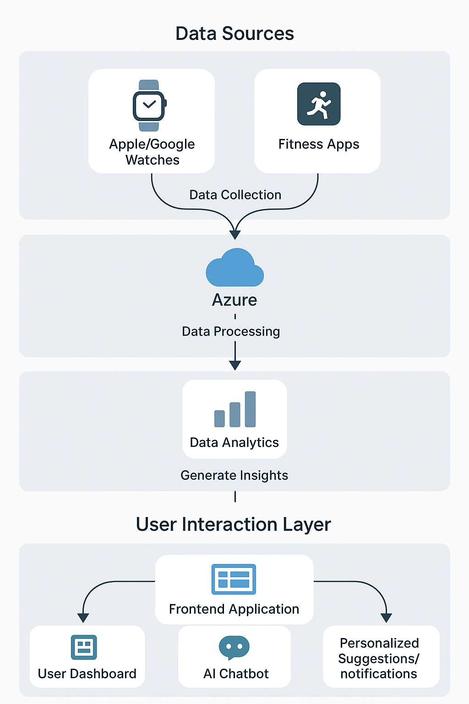
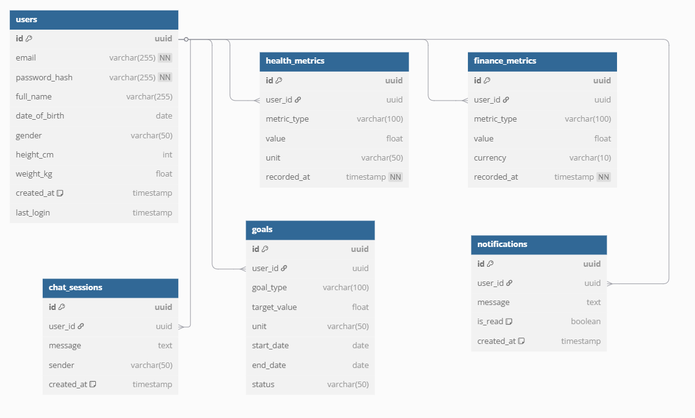

# RebootLondonHackathon

[Solution Design](#future-fit-solution-design)  

This is the repository for the Reboot London Hackathon.

## Fork this Repository

To fork this repository, select the `Fork` dropdown menu next to the title:

Then select `+ Create New Fork`:

For the `Repository name`, please make sure you enter your team's name so that we can keep track of the different repositories.

If your team is building multiple components and requires multiple repositories, fork this repository and enter the team name followed by the name of the component.

For example, if you have a `frontend` and `backend` application, the first fork can be called `TeamName-frontend` and the second fork can be called `TeamName-backend`.

> [!NOTE]
> If you're only building a single component, you can leave the `Repository name` as `TeamName`.

Once you've entered the name, select `Create fork`:

### Add Collaborators

Now that you've created your own fork, if another member within your team wants to contribute to the code, you would need to add them as a collaborator.

To do so, navigate to the repository containing your fork and click on `Settings`:

Then select the `Collaborators` option in the navigation menu on the left:

Select `Add people`:

And search for the `username`, `full name`, or `email` of the member you want to add to the repository.

Then they can clone your repository and contribute code to your fork.

> [!NOTE]
> Please make sure to add them to your forked version of the repository. You won't be able to add them here directly.
>
### How to sign in to GitHub Copilot

IT@LBG request will need to have been raised and completed before you can do the below:
 
Once you've been given a licence you'll be sent your username in an email (to your LBG email address).

When logging in use the username you've been given (example: charlotte-Boults_lbgghcp) this will remove the password field and redirect you to the Microsoft sign in page.

On the Microsoft sign in page use your LBG global credentials (example:Charlotte.boults@lloydsbanking.com) and password you use to log into your work device.

Once authentication is complete you should be re-directed to GitHub Copilot home page.

Now you're ready to start. Happy coding!

# Future Fit Solution Design

[Purpose](#purpose)  
[Database Layer](#database-layer)  
[Backend Layer](#backend-layer)  
[Frontend Layer](#frontend-layer)  
[Connectivity & Integration](#connectivity--integration)  
[Security & Compliance](#security--compliance)  
[Deployment](#deployment)

## Purpose:
Harness insights from user data around finance metrics, health metrics, chat history, and goals to provide valuable guidance and information to improve mental/physical health and overall wellness.

## High level flowchart 

## Database Layer
- **Technology:** PostgreSQL
- **Schema Overview:**
  - **users** – user profiles, preferences, subscription status
  - **health_metrics** – heart rate, sleep, steps, etc.
  - **finance_metrics** – monthly total outgoings, credit score, etc.
  - **chat_sessions** – message logs, timestamps, etc
  - **goals** – user-defined targets for fitness and wellness
  - **notifications** – alerts, reminders, and system messages

## Backend Layer
- **Technology Stack:** Flask Framework (Python)
- **Authentication:** OAuth + JWT – Azure AD and RBAC (Role-Based Access Control)
- **Responsibilities:**
  - **User Authentication and Authorization:**
    - OAuth and JWT tokens for secure authentication, using Azure AD for identity management.
    - Role-Based Access Control (RBAC) for managing user permissions.
  - **Business Logic:**
    - Implement core business logic for fitness tracking, finances tracking, goal setting, and wellness insights.
  - **Data Aggregation and Transformation:**
    - Process and aggregate data from various sources (health metrics, finance metrics, etc.) and process it for analysis and to provide context for the chat agent/notify users on metrics.
  - **Integration:**
    - Integrate with Google Fit (Android) and Apple HealthKit (iOS) to sync health-related data (e.g., steps, heart rate, sleep).
    - Integrate with Lloyds banking app to sync finance-related data.
    - Manage connections with other services like third-party workout apps, wellness apps, etc.
  - **Secure Messaging and Chat Handling:**
    - Implement secure chat functionality for user interaction with a professional consultant.
  - **Event-Based Notification Logic:**
    - Trigger notifications based on user activities or predefined conditions (e.g., goal achievement and wellness scores).
  - **Scheduled Jobs:**
    - Use scheduled jobs to send reminders, update daily summaries, and send notifications.

## Frontend Layer
- **Technology Stack:** Flask (Python Framework), Jinja (templating engine)
- **Key Features:**
  - **Dashboard:** A Flask route will serve a template with the user’s fitness data dynamically injected.
  - **Chat Interface:** Render a chat interface, and backend logic will handle chat interactions.
  - **Data Visualization:** Serve static files or dynamic content (e.g., using JavaScript libraries for rendering charts) to visualize the health metrics and trends.
  - **Settings & Preferences:** Users can manage their settings and preferences directly in the rendered template. The data will be passed to Flask routes to update preferences.

## Connectivity & Integration
- **Real-Time Communication:**
  - Use WebSockets or similar for real-time communication in the chat interface. Flask can support WebSocket communication via Flask-SocketIO.
- **Push Notifications:**
  - Azure Notification Hubs, which allows us to send notifications to iOS, Android, and other platforms using a single service with platform-specific configurations.
- **Health APIs:**
  - Google Fit (Android) and Apple HealthKit (iOS): Sync health-related metrics such as steps, heart rate, and workouts.
- **Analytics:**
  - Optionally, use custom ML models hosted via Azure ML for personalized wellness recommendations based on user data.
  - Use analytics tools to track user behaviour and app performance.

## Security & Compliance
- **HTTPS / TLS:** All communication between the client and the server will be encrypted using HTTPS.
- Ensure user data is handled according to appropriate standards, including user consent, and secure data storage.
- **End-to-End Encrypted Chat (optional):** Use encryption for chat sessions, ensuring user privacy and security.

## Deployment
Deployments will be carried out using Azure app service and can be scaled up with further solutions during further development.
